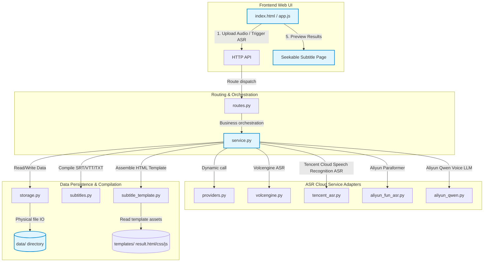

# Listening Scribe

> A self-hosted listening audio transcription tool that turns audio recordings into text, subtitles, and an interactive playback page with synchronized subtitle navigation.

English | [中文](README.md)

Listening Scribe is a self-hosted audio transcription tool. Users upload audio through a web UI, the server schedules cloud ASR providers, and automatically generates plain text, SRT, VTT, raw JSON, and a seekable HTML page with integrated audio playback and timestamp navigation.

It is designed for digitizing English listening exercises, class recordings, oral practice tracks, exam listening recordings, and other learning materials.

---

## 🏗️ System Architecture & Design

### 1. Architecture Flowchart

Below is the flowchart representing the core data flow and module interactions:



### 2. Core Modules Architecture

The codebase is built on a modular structure with clear separation of concerns:

| Module/File | Responsibility | Technical Details |
| --- | --- | --- |
| [`app.py`](file:///Users/xw/Documents/Codex/2026-05-13/files-mentioned-by-the-user-txt/server_asr/app.py) | Entrypoint | Based on Python's built-in `http.server`. Supports static assets routing, API dispatch, and a development `--reload` mode. |
| [`config.py`](file:///Users/xw/Documents/Codex/2026-05-13/files-mentioned-by-the-user-txt/server_asr/config.py) | Configuration | Loads the `.env` configuration file, initializes the `data/` data directories, and provides clean environment utilities. |
| [`routes.py`](file:///Users/xw/Documents/Codex/2026-05-13/files-mentioned-by-the-user-txt/server_asr/routes.py) | Router | Parses HTTP request headers, paths, and query arguments, forwarding calls to `service.py` with robust CORS handling. |
| [`http_utils.py`](file:///Users/xw/Documents/Codex/2026-05-13/files-mentioned-by-the-user-txt/server_asr/http_utils.py) | HTTP Utilities | Encapsulates standardized JSON responses, redirection schemes, Range requests (for audio dragging), and audio stream piping. |
| [`storage.py`](file:///Users/xw/Documents/Codex/2026-05-13/files-mentioned-by-the-user-txt/server_asr/storage.py) | Storage Management | Manages `manifest.json` indexing and computes SHA256 hashes to map uploaded audio files, preventing duplicate charging. |
| [`service.py`](file:///Users/xw/Documents/Codex/2026-05-13/files-mentioned-by-the-user-txt/server_asr/service.py) | Business Logic | Orchestrates the entire transcription lifecycle: Upload ➔ Hash Deduplication ➔ Task Submission ➔ Polling/Sync ➔ Compilation ➔ Deletion. |
| **`providers/`** | **ASR Engines Package** | **Aggregates integrated ASR engine adapters, grouped into a dedicated package.** |
| ├── [`providers/providers.py`](file:///Users/xw/Documents/Codex/2026-05-13/files-mentioned-by-the-user-txt/server_asr/providers/providers.py) | Providers Metadata | Declares the properties, guidelines, credential requirements, and support status of the integrated ASR services. |
| ├── [`providers/volcengine.py`](file:///Users/xw/Documents/Codex/2026-05-13/files-mentioned-by-the-user-txt/server_asr/providers/volcengine.py) | Volcengine Client | Implements the submit-and-poll lifecycle for Volcengine ASR. |
| ├── [`providers/tencent_asr.py`](file:///Users/xw/Documents/Codex/2026-05-13/files-mentioned-by-the-user-txt/server_asr/providers/tencent_asr.py) | Tencent Cloud Speech Recognition ASR Client | Built with native Tencent Cloud API 3.0 signing mechanisms (`CreateRecTask` / `DescribeTaskStatus`), eliminating SDK overhead. |
| ├── [`providers/aliyun_fun_asr.py`](file:///Users/xw/Documents/Codex/2026-05-13/files-mentioned-by-the-user-txt/server_asr/providers/aliyun_fun_asr.py) | Aliyun Fun-ASR | Integrates DashScope REST API for Paraformer-v2 and Fun-ASR models with multilingual sentence-level timestamp extraction. |
| └── [`providers/aliyun_qwen.py`](file:///Users/xw/Documents/Codex/2026-05-13/files-mentioned-by-the-user-txt/server_asr/providers/aliyun_qwen.py) | Aliyun Qwen Client | Integrates Aliyun's Qwen3-ASR-Flash voice LLM. Returns synchronous text transcripts without polling (no timestamps). |
| **`subtitles/`** | **Subtitle Packages** | **Manages data serialization and the interactive HTML player templates.** |
| ├── [`subtitles/subtitles.py`](file:///Users/xw/Documents/Codex/2026-05-13/files-mentioned-by-the-user-txt/server_asr/subtitles/subtitles.py) | Subtitle Generation | Parses the standardized cues and compiles them into `.txt`, `.srt`, `.vtt`, and raw `.json` formatted files. |
| ├── [`subtitles/subtitle_template.py`](file:///Users/xw/Documents/Codex/2026-05-13/files-mentioned-by-the-user-txt/server_asr/subtitles/subtitle_template.py) | Page Compilation | Hydrates static template pages with dynamic parameters, utilizing `TEMPLATE_VERSION` caching to manage immediate cache invalidation. |
| └── [`subtitles/templates/`](file:///Users/xw/Documents/Codex/2026-05-13/files-mentioned-by-the-user-txt/server_asr/subtitles/templates) | Player Templates | Frontend templates (HTML/CSS/JS) featuring custom control panels, precise seek mechanisms, and high-contrast synchronizations. |

---

## 🌟 Key Features

1. Multiple ASR Providers: Supports Volcengine Recorded Speech Recognition (Standard Edition) ASR, Tencent Cloud Speech Recognition ASR, Aliyun Paraformer-v2, Fun-ASR, and Qwen-ASR.
2. Single-Page UI: Bootstrap 5 web UI with history management, provider selection, real-time logging, and credential cookie settings.
3. Dual Credential Mode:
   * Supports server-side `.env` configuration to keep credentials completely hidden from clients.
   * Supports frontend temporary inputs (with "Remember credentials" options). Frontend inputs carry absolute priority, avoiding env-key overrides.
4. SHA256-Based Deduplication: Computes audio file hashes to check against existing manifests, yielding instant cache hits, zero repeated uploads, and zero repeated cloud costs.
5. No Cloud Object Storage (COS) Dependency: Audio and transcription files are fully hosted on the local server, preventing CORS limits, expired links, and Range requests dragging issues.
6. No Third-Party Python Dependencies: Built entirely on native Python standard libraries.

---

## 🛠️ Installation & Getting Started

### 1. Requirements for Publicly Reachable URL

Because cloud ASR engines (Volcengine, Aliyun, Tencent Cloud Speech Recognition) pull audio files asynchronously, their servers must be able to fetch the audio file from your server over the internet.

Therefore, the app requires a publicly reachable URL:
* Cloud Server (VPS) Deployment: If deploying on a public VPS, simply set your domain or public IP.
* Local Machine with Intranet Penetration: If running locally (e.g. localhost / 127.0.0.1) and using an intranet penetration / tunneling tool (e.g. frp, ngrok, cloudflare tunnel), set `PUBLIC_BASE_URL` to your public mapped address.
* Local Machine without Intranet Penetration (Cloud Storage Upload): You can configure a private cloud storage bucket (Tencent Cloud Speech Recognition COS or Aliyun OSS). The backend will automatically upload the audio file to your cloud storage before submitting the task, generate a 24-hour pre-signed GET URL for cloud ASR downloads, and automatically delete the audio from the cloud storage once the ASR task is finalized (success or failure) to minimize storage costs.

### 2. Configure Environment

```bash
cp config.example.env .env
```

Edit your `.env` to configure your keys and the public base URL:

```env
# Volcengine Recorded Speech Recognition - Standard Edition (Seed-ASR)
VOLCENGINE_API_KEY=your_volcengine_api_key
VOLCENGINE_RESOURCE_ID=volc.seedasr.auc
VOLCENGINE_MODEL_VERSION=400

# Aliyun DashScope (DashScope API Key)
DASHSCOPE_API_KEY=your_dashscope_api_key

# Tencent Cloud Speech Recognition ASR
TENCENT_SECRET_ID=your_tencent_secret_id
TENCENT_SECRET_KEY=your_tencent_secret_key
TENCENT_REGION=ap-guangzhou

# Cloud Storage Upload (Optional, recommended for local deployment without tunneling)
# Supported values: cos (Tencent Cloud Speech Recognition) or oss (Aliyun), leave empty to use local storage URL
UPLOAD_PROVIDER=

# Tencent Cloud Speech Recognition COS Configs (Optional, falls back to TENCENT_SECRET_ID/KEY/REGION)
COS_SECRET_ID=
COS_SECRET_KEY=
COS_REGION=ap-guangzhou
COS_BUCKET=your-cos-bucket-name

# Aliyun OSS Configs (Optional)
OSS_ACCESS_KEY_ID=your_oss_access_key_id
OSS_ACCESS_KEY_SECRET=your_oss_access_key_secret
OSS_ENDPOINT=oss-cn-hangzhou.aliyuncs.com
OSS_BUCKET=your-oss-bucket-name

# Server Configurations
PORT=8789
PUBLIC_BASE_URL=https://your-public-domain-or-tunnel.com  # Optional if UPLOAD_PROVIDER is configured
DATA_DIR=data
MAX_UPLOAD_MB=500
ALLOWED_ORIGIN=*
```

### 3. Run the App

#### Method A: Physical Host
Requires Python 3.12 or newer. No pip installations required.

```bash
# Production Run (default log level is INFO)
python3 app.py

# Configure Log Level (supports DEBUG, INFO, WARNING, ERROR etc. can also use --log)
python3 app.py --log-level DEBUG

# Development Mode with DEBUG logs (hot reload enabled, static assets browser caching disabled)
python3 app.py --reload --log-level DEBUG
```

#### Method B: Docker Deployment
Run using our lightweight Alpine-Python Docker Compose stack:

```bash
docker compose up -d --build
```

---

## ⚙️ Nginx Reverse Proxy Recommendation

We recommend hosting your deployment behind Nginx with SSL enabled:

```nginx
server {
    listen 80;
    listen 443 ssl http2;
    server_name your-public-domain-or-tunnel.com;

    ssl_certificate /path/to/fullchain.pem;
    ssl_certificate_key /path/to/privkey.pem;
    
    client_max_body_size 500m;

    location / {
        proxy_pass http://127.0.0.1:8789;
        proxy_set_header Host $host;
        proxy_set_header X-Real-IP $remote_addr;
        proxy_set_header X-Forwarded-For $proxy_add_x_forwarded_for;
        proxy_set_header X-Forwarded-Proto $scheme;
        
        # Disable buffering to ensure real-time upload progress and streaming logs
        proxy_buffering off;
    }
}
```

---

## 💾 Outputs Structure

Upon successful transcription, files are arranged in the `data/results/<record_id>/` directory:

```text
├── <filename>                    # Original audio file
├── transcript/
│   └── <filename>.txt            # Plain text transcript
├── subtitles/
│   ├── <filename>.srt            # SRT subtitle file
│   └── <filename>.vtt            # WebVTT subtitle file
├── raw/
│   └── <filename>.<provider>.json # Full raw ASR JSON response
├── <filename>_字幕跳转.html        # Interactive HTML page with synchronized navigation
└── manifest.json                 # Transcript record metadata index
```

---

## 🔒 Security Practices

1. Credential Protection: Never commit your `.env` containing live secrets to a public Git repository.
2. Access Control: For deployments open to the public web, configure Basic Auth in Nginx or firewall limits to prevent unauthorized resource utilization.
3. Data Safety: The local `data/` runtime directories are ignored in `.gitignore`, keeping your uploaded audio assets fully secured.

---

## 📄 License

This project is licensed under the [MIT License](LICENSE).
