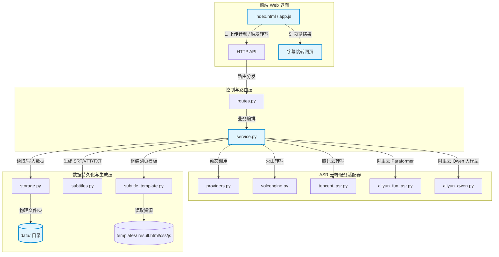

# Listening Scribe

> 听力转写助手：自托管听力音频转写工具，支持将音频录音转换为文本、字幕和带交互的跳转播放页面。

[English](README.en.md) | 中文

Listening Scribe 是一个自托管的听力音频转写工具。用户可以在 Web 界面中上传音频，程序调用云端 ASR 接口，生成纯文本、SRT、VTT、原始 JSON 以及一个带有音频播放器和字幕时间戳跳转功能的 HTML 字幕交互网页。

它适合处理英语听力材料、课程录音、口语练习、试卷听力录音等需要数字化整理的场景。

---

## 🏗️ 系统架构与设计

### 1. 架构拓扑图

系统的核心数据流向与组件交互结构如下：



### 2. 核心文件架构说明

项目代码采用模块化结构构建，各模块分工如下：

| 模块/文件 | 核心职责 | 技术实现与说明 |
| --- | --- | --- |
| [`app.py`](file:///Users/xw/Documents/Codex/2026-05-13/files-mentioned-by-the-user-txt/server_asr/app.py) | 服务入口 | 基于 Python 标准库 `http.server`，提供静态资源托底服务、API 路由派发及 `--reload` 自动重载热更新功能。 |
| [`config.py`](file:///Users/xw/Documents/Codex/2026-05-13/files-mentioned-by-the-user-txt/server_asr/config.py) | 全局配置与环境初始化 | 负责加载 `.env` 配置文件，管理运行目录（如 `data/`），提供全局的环境变量转换方法。 |
| [`routes.py`](file:///Users/xw/Documents/Codex/2026-05-13/files-mentioned-by-the-user-txt/server_asr/routes.py) | HTTP 路由控制 | 解析 HTTP 请求方法、路径与查询参数，分发至 `service.py` 对应的方法，提供跨域支持。 |
| [`http_utils.py`](file:///Users/xw/Documents/Codex/2026-05-13/files-mentioned-by-the-user-txt/server_asr/http_utils.py) | HTTP 工具集 | 封装了 JSON 响应、重定向、大文件断点续传（Range 请求）及音频流直通等机制。 |
| [`storage.py`](file:///Users/xw/Documents/Codex/2026-05-13/files-mentioned-by-the-user-txt/server_asr/storage.py) | 数据持久化与索引 | 维护 `manifest.json` 索引，实现对音频的 SHA256 唯一性校验，避免相同文件重复上传与重复识别计费。 |
| [`service.py`](file:///Users/xw/Documents/Codex/2026-05-13/files-mentioned-by-the-user-txt/server_asr/service.py) | 业务流程编排 | 协调“上传 ➔ 去重校验 ➔ 云端任务分发 ➔ 状态轮询/同步响应 ➔ 字幕生成 ➔ 历史管理”的完整流程逻辑。 |
| **`providers/`** | **ASR 引擎适配包** | **聚合了五大 ASR 引擎适配器模块，按功能独立划分。** |
| ├── [`providers/providers.py`](file:///Users/xw/Documents/Codex/2026-05-13/files-mentioned-by-the-user-txt/server_asr/providers/providers.py) | 服务商元数据声明 | 统一声明五大转写服务的配置约束（凭证字段、引导信息、支持特性等），动态输出给前端界面渲染。 |
| ├── [`providers/volcengine.py`](file:///Users/xw/Documents/Codex/2026-05-13/files-mentioned-by-the-user-txt/server_asr/providers/volcengine.py) | 火山引擎 ASR 客户端 | 封装火山引擎“提交录音任务 (submit) + 轮询查询 (query)”的 HTTP 交互逻辑。 |
| ├── [`providers/tencent_asr.py`](file:///Users/xw/Documents/Codex/2026-05-13/files-mentioned-by-the-user-txt/server_asr/providers/tencent_asr.py) | 腾讯云 ASR 客户端 | 基于腾讯云 API 3.0 签名机制，原生实现 `CreateRecTask` 和 `DescribeTaskStatus`，不依赖第三方 SDK。 |
| ├── [`providers/aliyun_fun_asr.py`](file:///Users/xw/Documents/Codex/2026-05-13/files-mentioned-by-the-user-txt/server_asr/providers/aliyun_fun_asr.py) | 阿里云百炼 Fun-ASR | 原生对接 DashScope REST API 录音文件转写服务，支持 Paraformer-v2 和 Fun-ASR 模型的多语言句级时间戳。 |
| ├── [`providers/aliyun_qwen.py`](file:///Users/xw/Documents/Codex/2026-05-13/files-mentioned-by-the-user-txt/server_asr/providers/aliyun_qwen.py) | 阿里云百炼 Qwen-ASR | 对接千问语音大模型（Qwen3-ASR-Flash），使用同步调用接口（仅生成纯文本，无时间戳）。 |
| **`subtitles/`** | **字幕生成与渲染包** | **专门负责字幕数据的序列化及跳转播放页的渲染。** |
| ├── [`subtitles/subtitles.py`](file:///Users/xw/Documents/Codex/2026-05-13/files-mentioned-by-the-user-txt/server_asr/subtitles/subtitles.py) | 字幕格式生成 | 解析各云端返回的标准化 Cues 列表，生成并输出 `.txt` 文本、`.srt` 字幕、`.vtt` 字幕及原始 `.json` 结构。 |
| ├── [`subtitles/subtitle_template.py`](file:///Users/xw/Documents/Codex/2026-05-13/files-mentioned-by-the-user-txt/server_asr/subtitles/subtitle_template.py) | 字幕网页渲染引擎 | 负责将 `templates/` 下的网页源码装配动态数据，通过 `TEMPLATE_VERSION` 机制实现样式重构。 |
| └── [`subtitles/templates/`](file:///Users/xw/Documents/Codex/2026-05-13/files-mentioned-by-the-user-txt/server_asr/subtitles/templates) | 字幕播放页前端模板 | 包含置顶播放控制栏、进度拖动、高亮聚焦字幕行等交互式播放源码。 |

---

## 🌟 功能特点

1. 多服务商支持：已全量接入火山引擎、阿里云百炼、腾讯云 ASR 服务。
2. 单页交互界面：主页使用 Bootstrap 5 构建，支持历史记录管理、服务商切换、接口日志实时追加以及 API 密钥 Cookie 选项。
3. 双重凭证安全机制：
   * 支持后端 `.env` 全局配置，对访问者隐藏凭证细节；
   * 支持前端 Web 界面临时输入 API 凭证，前端输入具有绝对优先权，避免环境变量覆盖问题。
4. 智能 SHA256 去重：上传音频时自动计算哈希并匹配，命中缓存时秒级返回结果，避免重复上传和扣费。支持勾选“强制重新识别”。
5. 本地存储：音频文件和转写结果完全保存在部署服务器本地，不依赖第三方对象存储（COS/OSS）。
6. 无第三方依赖：后端基于 Python 纯原生标准库构建，不需要执行 `pip install` 安装第三方包，部署简单。

---

## 🛠️ 部署指南

### 1. 部署环境与公网地址要求

由于本工具调用的是云端的 ASR 接口，云端服务器（如火山引擎、阿里云、腾讯云）在接收到转写请求后，需要通过网络拉取您服务器上的音频文件。

因此，本工具必须配置一个可从公网访问的地址：
* 公网云服务器部署：如果部署在公网 VPS，配置可访问该 VPS 的域名或公网 IP 即可。
* 本地物理机且有公网 IP/域名：必须使用内网穿透工具（如 frp、ngrok、cloudflare tunnel）将本地端口（默认 8789）暴露到公网，并将 `PUBLIC_BASE_URL` 设置为该穿透公网地址。
* 本地物理机且无内网穿透：可通过配置云存储（Tencent COS 或 Aliyun OSS）。配置后，系统会在提交转写任务前自动将音频上传至您指定的私有云存储桶，并生成 24 小时过期的预签名 GET 地址供云端 ASR 引擎下载；转写任务完成（成功或失败）后，系统将自动从云存储空间中删除该音频以节省空间。

### 2. 配置环境变量

```bash
cp config.example.env .env
```

编辑 `.env` 文件：

```env
# 火山引擎 (Seed-ASR)
VOLCENGINE_API_KEY=your_volcengine_api_key
VOLCENGINE_RESOURCE_ID=volc.seedasr.auc
VOLCENGINE_MODEL_VERSION=400

# 阿里云百炼 (DashScope API Key)
DASHSCOPE_API_KEY=your_dashscope_api_key

# 腾讯云 ASR
TENCENT_SECRET_ID=your_tencent_secret_id
TENCENT_SECRET_KEY=your_tencent_secret_key
TENCENT_REGION=ap-guangzhou

# 云存储上传配置（可选，本地部署且不使用内网穿透时推荐配置）
# 支持的值：cos（腾讯云）或 oss（阿里云），留空则使用本地存储 URL
UPLOAD_PROVIDER=

# 腾讯云 COS 配置 (可选，留空则默认复用 TENCENT_SECRET_ID 和 TENCENT_SECRET_KEY)
COS_SECRET_ID=
COS_SECRET_KEY=
COS_REGION=ap-guangzhou
COS_BUCKET=your-cos-bucket-name

# 阿里云 OSS 配置 (可选)
OSS_ACCESS_KEY_ID=your_oss_access_key_id
OSS_ACCESS_KEY_SECRET=your_oss_access_key_secret
OSS_ENDPOINT=oss-cn-hangzhou.aliyuncs.com
OSS_BUCKET=your-oss-bucket-name

# 服务端配置
PORT=8789
PUBLIC_BASE_URL=https://your-public-domain-or-tunnel.com  # 如果配置了 UPLOAD_PROVIDER，此项可留空
DATA_DIR=data
MAX_UPLOAD_MB=500
ALLOWED_ORIGIN=*
```

### 3. 启动运行

#### 方式 A：物理机/本地运行
需要 Python 3.12 或更高版本：

```bash
# 启动生产服务
python3 app.py

# 开发模式启动（支持修改代码自动重载，静态资源不启用浏览器缓存）
python3 app.py --reload
```

#### 方式 B：Docker 部署
使用自带的 Dockerfile 及 Docker Compose 运行：

```bash
docker compose up -d --build
```

---

## ⚙️ Nginx 反向代理配置建议

如果通过 Nginx 进行反向代理，建议配置示例如下：

```nginx
server {
    listen 80;
    listen 443 ssl http2;
    server_name your-public-domain-or-tunnel.com;

    # SSL 证书
    ssl_certificate /path/to/fullchain.pem;
    ssl_certificate_key /path/to/privkey.pem;
    
    # 限制上传音频最大体积
    client_max_body_size 500m;

    location / {
        proxy_pass http://127.0.0.1:8789;
        proxy_set_header Host $host;
        proxy_set_header X-Real-IP $remote_addr;
        proxy_set_header X-Forwarded-For $proxy_add_x_forwarded_for;
        proxy_set_header X-Forwarded-Proto $scheme;
        
        # 禁用缓冲以保证上传进度和实时日志显示
        proxy_buffering off;
    }
}
```

---

## 💾 输出文件清单

成功转写后，对应记录的物理目录下（默认 `data/results/<record_id>/`）将输出以下文件：

```text
├── <filename>                    # 原始音频 file
├── transcript/
│   └── <filename>.txt            # 纯文本转写内容
├── subtitles/
│   ├── <filename>.srt            # 行业标准 SRT 字幕文件
│   └── <filename>.vtt            # 网页原生 WebVTT 字幕文件
├── raw/
│   └── <filename>.<provider>.json # 云端 ASR 原始最详 JSON 响应
├── <filename>_字幕跳转.html        # 高交互的音画同步播放字幕跳转页
└── manifest.json                 # 转写记录元数据配置
```

---

## 🔒 安全说明

1. 凭证保护：不要将包含真实 API 密钥的 `.env` 文件提交到任何公开仓库。
2. 访问控制：如果部署在公网环境，建议配置 Nginx 基本认证（Basic Auth）或防火墙限制以保护您的资源额度。
3. 数据存放：音频和生成网页存放在 `data/` 目录中，该目录默认已在 `.gitignore` 中排除，不会提交到 Git。

---

## 📄 开源协议

本项目采用 [MIT License](LICENSE) 协议开源。
