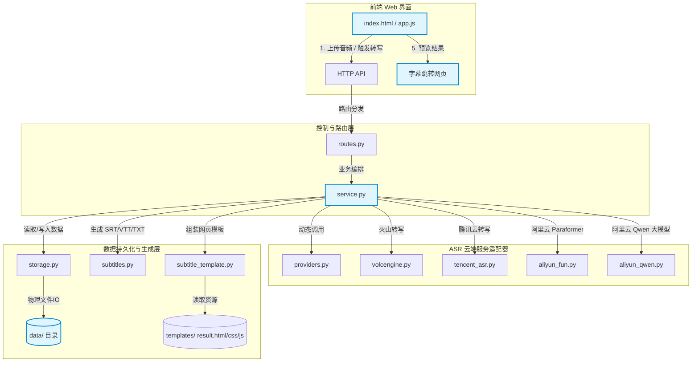

# Listening Scribe

> 听力转写助手：一站式自托管音频转写解决方案，将录音转换为文本、字幕和高交互的可跳转播放网页。

[English](README.en.md) | 中文

Listening Scribe 是一个自托管的听力音频转写工具。用户可以在极简、高端的 Web 界面中上传音频，程序将自动调用云端 ASR 接口，生成纯文本、SRT、VTT、原始 JSON，以及一个内嵌音频播放器与字幕时间戳跳转功能的 HTML 字幕交互网页。

它非常适合处理英语听力材料、课程录音、口语练习、试卷听力录音等需要深度数字化整理的场景。

---

## 🏗️ 系统架构与设计

### 1. 架构拓扑图

以下为系统的核心数据流向与组件交互拓扑图：



### 2. 核心文件架构说明

项目代码采用**高内聚、低耦合**的模块化结构进行构建，各模块分工明确：

| 模块/文件 | 核心职责 | 技术实现与设计要点 |
| --- | --- | --- |
| [**`app.py`**](file:///Users/xw/Documents/Codex/2026-05-13/files-mentioned-by-the-user-txt/server_asr/app.py) | 服务入口启动器 | 基于 Python 标准库 `http.server`，提供静态资源托底服务、API 路由派发及 `--reload` 自动重载热更新功能。 |
| [**`asr_app/config.py`**](file:///Users/xw/Documents/Codex/2026-05-13/files-mentioned-by-the-user-txt/server_asr/asr_app/config.py) | 全局配置与环境初始化 | 负责加载 `.env` 配置文件，管理运行目录（如 `data/`），提供全局的环境变量转换安全方法。 |
| [**`asr_app/routes.py`**](file:///Users/xw/Documents/Codex/2026-05-13/files-mentioned-by-the-user-txt/server_asr/asr_app/routes.py) | HTTP 路由控制中心 | 解析 HTTP 请求方法、路径与查询参数，分发至 `service.py` 对应的方法，对跨域（CORS）提供高兼容性支持。 |
| [**`asr_app/http_utils.py`**](file:///Users/xw/Documents/Codex/2026-05-13/files-mentioned-by-the-user-txt/server_asr/asr_app/http_utils.py) | HTTP 工具集 | 封装了 JSON 响应规范、重定向机制、大文件断点续传（Range 请求）及音频流直通托底机制。 |
| [**`asr_app/storage.py`**](file:///Users/xw/Documents/Codex/2026-05-13/files-mentioned-by-the-user-txt/server_asr/asr_app/storage.py) | 数据持久化与元数据库 | 维护 `manifest.json` 索引，实现对音频的 SHA256 唯一性校验哈希索引，避免重复上传与冗余计费。 |
| [**`asr_app/service.py`**](file:///Users/xw/Documents/Codex/2026-05-13/files-mentioned-by-the-user-txt/server_asr/asr_app/service.py) | 核心业务流编排中心 | 协调“上传 ➔ 去重校验 ➔ 云端任务分发 ➔ 状态轮询/同步响应 ➔ 字幕生成 ➔ 历史管理”的完整状态机逻辑。 |
| [**`asr_app/providers.py`**](file:///Users/xw/Documents/Codex/2026-05-13/files-mentioned-by-the-user-txt/server_asr/asr_app/providers.py) | ASR 服务商元数据中心 | 统一声明五大转写服务的配置约束（凭证字段、引导信息、支持特性等），动态输出给前端界面渲染。 |
| [**`asr_app/volcengine.py`**](file:///Users/xw/Documents/Codex/2026-05-13/files-mentioned-by-the-user-txt/server_asr/asr_app/volcengine.py) | 火山引擎 ASR 客户端 | 封装火山引擎“提交录音任务 (submit) + 轮询查询 (query)”的 HTTP 交互逻辑。 |
| [**`asr_app/tencent_asr.py`**](file:///Users/xw/Documents/Codex/2026-05-13/files-mentioned-by-the-user-txt/server_asr/asr_app/tencent_asr.py) | 腾讯云 ASR 客户端 | 基于腾讯云 API 3.0 签名机制，原生实现 `CreateRecTask` 和 `DescribeTaskStatus`，免除第三方 SDK 依赖。 |
| [**`asr_app/aliyun_fun.py`**](file:///Users/xw/Documents/Codex/2026-05-13/files-mentioned-by-the-user-txt/server_asr/asr_app/aliyun_fun.py) | 阿里云百炼 Paraformer 客户端 | 原生对接 DashScope REST API 的录音文件转写服务，支持 Paraformer-v2 和 Fun-ASR 模型的多语言句级时间戳。 |
| [**`asr_app/aliyun_qwen.py`**](file:///Users/xw/Documents/Codex/2026-05-13/files-mentioned-by-the-user-txt/server_asr/asr_app/aliyun_qwen.py) | 阿里云百炼 Qwen-ASR 客户端 | 对接千问语音大模型（Qwen3-ASR-Flash），使用同步调用接口，提供极速响应和卓越的语义纠错能力（仅生成纯文本）。 |
| [**`asr_app/subtitles.py`**](file:///Users/xw/Documents/Codex/2026-05-13/files-mentioned-by-the-user-txt/server_asr/asr_app/subtitles.py) | 字幕格式编译器 | 解析各云端返回的标准化 Cues 列表，编译输出标准的 `.txt` 文本、`.srt` 字幕、`.vtt` 字幕及原始 `.json` 结构。 |
| [**`asr_app/subtitle_template.py`**](file:///Users/xw/Documents/Codex/2026-05-13/files-mentioned-by-the-user-txt/server_asr/asr_app/subtitle_template.py) | 字幕交互网页渲染引擎 | 负责将 `templates/` 下的网页源码装配动态数据，通过 `TEMPLATE_VERSION` 机制实现样式秒级重构。 |
| [**`asr_app/templates/`**](file:///Users/xw/Documents/Codex/2026-05-13/files-mentioned-by-the-user-txt/server_asr/asr_app/templates) | 交互式字幕播放器前端模板 | 采用极简、高端的 CSS 变量设计系统。包含置顶控制栏、高精度毫秒级跳进度、音画同步的高亮聚焦字幕行等。 |

---

## 🌟 功能特点

1. **五大 ASR 模型全集成**：不仅预留入口，目前已**全量且深度接入**火山引擎、阿里云（Paraformer/Qwen大模型）、腾讯云，提供完整的云端转写能力。
2. **极简而奢华的设计美学**：采用现代感极强的深灰与淡雅米色搭配，卡片式布局，微交互动画，支持完全单页式交互（100vh 无溢出滚动条）。
3. **双重凭证安全机制**：
   * 支持后端 `.env` 全局配置，对访客隐藏凭证细节；
   * 支持前端 Web 界面临时输入 API Key（可选择记住到本地 Cookie），**前端输入具有绝对优先权**，完美避免了环境变量覆盖问题。
4. **精细的对齐系统**：表单组件水平文字基准线（Baseline）经过严密核准，高度统一。
5. **智能 SHA256 缓存去重**：自动计算音频哈希，检测到已转写音频时**秒级命中缓存**，零重复上传，零重复扣费。支持一键勾选“强制重新识别”。
6. **无 COS 等对象存储依赖**：音频与识别结果完全寄宿在您自己的服务器上，完美规避了跨域（CORS）、签名 URL 过期和 Range 拖动卡顿问题。
7. **极轻量自托管**：全项目基于 Python 纯原生标准库构建，**无任何第三方 Python 包依赖**，极易部署。

---

## 🛠️ 部署指南

### 1. 克隆项目并配置环境变量

```bash
cp config.example.env .env
```

编辑 `.env` 文件，填入您的密钥和公网访问域名：

```env
# 火山引擎 (Seed-ASR)
VOLCENGINE_API_KEY=your_volcengine_api_key
VOLCENGINE_RESOURCE_ID=volc.seedasr.auc
VOLCENGINE_MODEL_VERSION=400

# 阿里云百炼 (DashScope API Key)
DASHSCOPE_API_KEY=your_dashscope_api_key

# 腾讯云 ASR
TENCENT_SECRET_ID=your_tencent_secret_id
TENCENT_SECRET_KEY=your_tencent_secret_key
TENCENT_REGION=ap-guangzhou

# 服务端配置
PORT=8789
PUBLIC_BASE_URL=https://asr.yourdomain.com
DATA_DIR=data
MAX_UPLOAD_MB=500
ALLOWED_ORIGIN=*
```

> ⚠️ **重要**：因语音识别服务（如火山、阿里、腾讯）均采用“异步回调或轮询拉取音频”的机制，您必须配置 `PUBLIC_BASE_URL` 为外部云端服务能够正常访问的**公网域名或外网 IP**。

### 2. 运行方式

#### A. 本地/物理机运行
仅需 Python 3.12 或更高版本，无需安装任何 pip 依赖：

```bash
# 启动生产服务
python3 app.py

# 启动开发模式（支持代码热重载，静态资源 no-store 缓存）
python3 app.py --reload
```

#### B. Docker 一键部署
项目自带极简的 Alpine-Python 镜像和 Docker Compose 编排：

```bash
docker compose up -d --build
```

---

## ⚙️ Nginx 反向代理配置建议

推荐通过 Nginx 提供 HTTPS 安全通道，以下是生产级 Nginx 配置示例：

```nginx
server {
    listen 80;
    listen 443 ssl http2;
    server_name asr.yourdomain.com;

    # SSL 证书配置
    ssl_certificate /path/to/fullchain.pem;
    ssl_certificate_key /path/to/privkey.pem;
    
    # 限制上传音频最大体积
    client_max_body_size 500m;

    location / {
        proxy_pass http://127.0.0.1:8789;
        proxy_set_header Host $host;
        proxy_set_header X-Real-IP $remote_addr;
        proxy_set_header X-Forwarded-For $proxy_add_x_forwarded_for;
        proxy_set_header X-Forwarded-Proto $scheme;
        
        # 禁用缓冲以保证上传进度条实时显示
        proxy_buffering off;
    }
}
```

---

## 💾 输出文件清单

成功转写后，对应记录的物理目录下（默认 `data/results/<record_id>/`）将输出以下文件：

```text
├── <filename>                    # 原始音频文件
├── transcript/
│   └── <filename>.txt            # 纯文本转写内容
├── subtitles/
│   ├── <filename>.srt            # 行业标准 SRT 字幕文件
│   └── <filename>.vtt            # 网页原生 WebVTT 字幕文件
├── raw/
│   └── <filename>.<provider>.json # 云端 ASR 原始最详 JSON 响应
├── <filename>_字幕跳转.html        # 高交互的音画同步播放字幕跳转页
└── manifest.json                 # 转写记录元数据配置
```

---

## 🔒 安全说明

1. **凭证隔离**：请勿将包含真实密钥的 `.env` 上传至任何公开 Git 仓库。
2. **私有云保障**：若部署在完全开放的公网环境，强烈建议在 Nginx 层增加基本认证（Basic Auth）或防火墙限制，以保护您的音频资产与云账户额度。
3. **数据独立性**：`data/` 目录中包含全部音频 and 生成网页，已默认配置在 `.gitignore` 中，绝对不会发生数据意外泄漏。

---

## 📄 开源协议

本项目采用 [MIT License](LICENSE) 协议开源。
